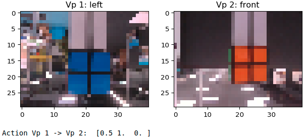

# rubiks-dataset
Dataset to assess the differences between the unsupervised learning methods ICM and M²VAE

If you use this dataset in your work, please cite it as follows:

## Bibtex

```
@misc{korthals2019perceived,
archivePrefix = {arXiv},
arxivId = {cs.RO/1911.00584},
author = {Korthals, Timo and Schilling, Malte and Leitner, Jürgen},
eprint = {1911.00584},
pages = {2},
primaryClass = {cs.RO},
title = {{A Perceived Environment Design using a Multi-Modal Variational Autoencoder for learning Active-Sensing}},
url = {https://sites.google.com/site/dpgmcar2019/home},
year = {2019}
}
```

## Description



Check out the [YouTube](https://www.youtube.com/watch?v=VuL7Gp84WtE) video to
see, how the data was generated.

rubiks is a dataset of three different views on a Rubik cube which where
sampled by performing viewpoint changes with a Franka Emica Panda robot.

## Latent factor values

*   Viewpoint (impact on the background): ['left', 'front', 'right']
*   Rubik's state (impact on the foreground): [['blue', 'red', 'green'], ...]
*   Actions (from -> to): [['left', 'front'], ['left','right'], ...]

### All possible Rubik states for the corresponding viewpoints

| Rubik's state  | left | front | right |
|--- | --- | --- | --- |
|1|blue  |red   |green|
|2|blue  |yellow|green|
|3|blue  |orange|green|
|4|blue  |white |green|
|5|green |red   |blue|
|6|green |yellow|blue|
|7|green |orange|blue|
|8|green |white |blue|
|9|white |orange|yellow|
|10|white |red   |yellow|
|11|white |green |yellow|
|12|white |blue  |yellow|
|13|yellow|red   |white|
|14|yellow|orange|white|
|15|yellow|green |white|
|16|yellow|blue  |white|
|17|orange|green |red|
|18|orange|blue  |red|
|19|orange|yellow|red|
|20|orange|white |red|
|21|red |green   |orange|
|22|red |blue    |orange|
|23|red |yellow  |orange|
|24|red |white   |orange|

### All actions and corresponding action representation

| Action | Viewpoint 1 | Viewpoint 2 | left-state | front-state | right-state |
| --- | --- | --- | --- | --- | --- |
|1|left|front |0 |1 |-1|
|2|left|right |0 |-1|1|
|3|front|left |1 |0 |-1|
|4|front|right|-1|0 |1|
|5|right|left |1 |-1|0|
|6|right|front|-1|1 |0|
